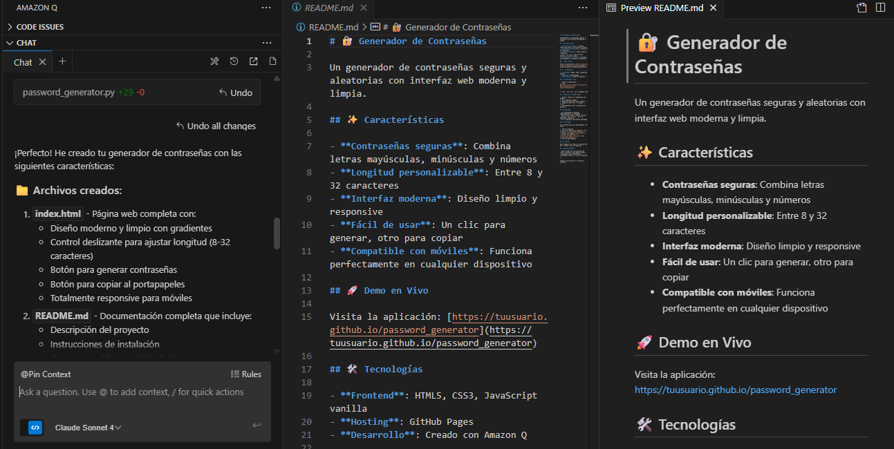

# 🔐 Generador de Contraseñas

Un generador de contraseñas seguras y aleatorias con interfaz web moderna y limpia.

## ✨ Características

- **Contraseñas seguras**: Combina letras mayúsculas, minúsculas y números
- **Longitud personalizable**: Entre 8 y 32 caracteres
- **Interfaz moderna**: Diseño limpio y responsive
- **Fácil de usar**: Un clic para generar, otro para copiar
- **Compatible con móviles**: Funciona perfectamente en cualquier dispositivo

## 🚀 Demo en Vivo

Visita la aplicación: ([https://tuusuario.github.io/password_generator](https://maecaraballo.github.io/password-generator/))

## 🛠️ Tecnologías

- **Frontend**: HTML5, CSS3, JavaScript vanilla
- **Hosting**: GitHub Pages
- **Desarrollo**: Creado con Amazon Q

## 📦 Instalación Local

1. Clona el repositorio:
```bash
git clone https://github.com/tuusuario/password_generator.git
cd password_generator
```

2. Abre `index.html` en tu navegador web

## 🌐 Publicar en GitHub Pages

1. Sube el código a tu repositorio de GitHub
2. Ve a Settings → Pages
3. Selecciona "Deploy from a branch"
4. Elige la rama `main` y carpeta `/ (root)`
5. ¡Tu generador estará disponible en minutos!

## 🔒 Seguridad

- Las contraseñas se generan completamente en el navegador
- No se envían datos a ningún servidor
- Utiliza `Math.random()` para la generación aleatoria
- No se almacenan contraseñas generadas

## 🤝 Contribuir

Las contribuciones son bienvenidas. Por favor:

1. Fork el proyecto
2. Crea una rama para tu feature (`git checkout -b feature/AmazingFeature`)
3. Commit tus cambios (`git commit -m 'Add some AmazingFeature'`)
4. Push a la rama (`git push origin feature/AmazingFeature`)
5. Abre un Pull Request

## 📄 Licencia

Este proyecto está bajo la Licencia MIT. Ver `LICENSE` para más detalles.

## Amazon Q



- Desarrollado con la asistencia de [Amazon Q](https://aws.amazon.com/q/)
- Inspirado en la necesidad de contraseñas seguras y fáciles de generar

---

⭐ ¡Dale una estrella si te gusta el proyecto!
